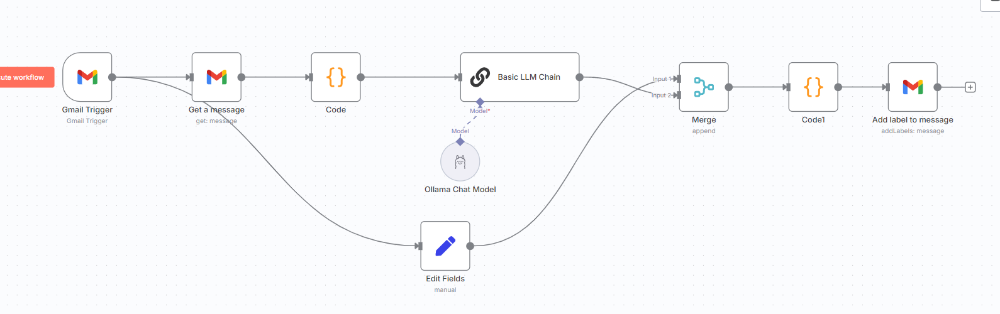
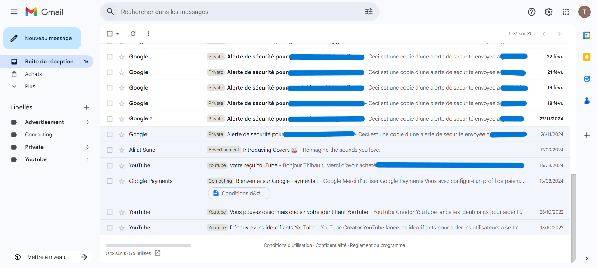
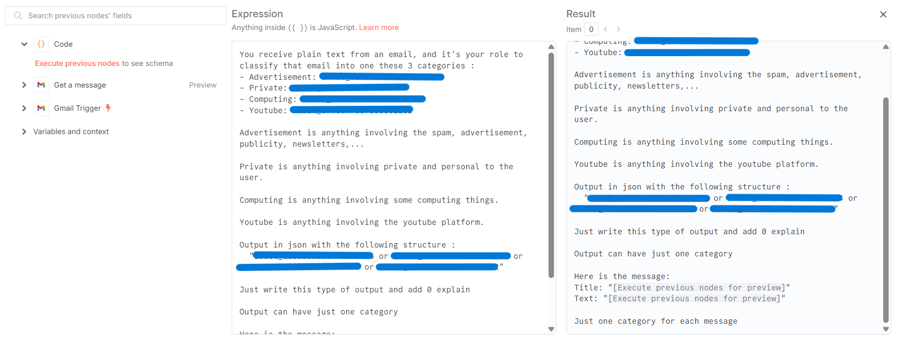

# 📧🤖 Smart Gmail Labeling with n8n & Local LLM

  
  

## 📝 Project Description

This project automatically **categorizes and labels your Gmail emails** using a **local AI model (LLM via Ollama)** and **n8n workflow automation**.  
Every time a new email arrives in your inbox, it's analyzed by your local AI, classified into predefined categories, and automatically labeled in Gmail.

⚡️ Essentially, you have an intelligent email sorting assistant running entirely on your own machine — ensuring privacy and full control over your data!

---

## ⚙️ Features

🧠 **Local LLM processing** — Emails are classified by your own AI model (via Ollama).  

📧 **Gmail API integration** — Automatic retrieval and labeling of incoming emails.  

🪄 **n8n automation** — Complete workflow to fetch, analyze, and label emails automatically.  

🔒 **Privacy-focused** — All AI processing happens locally on your machine.  

🧩 **Modular structure** — Easy to adapt categories and classification logic.  

🏷️ **Smart categorization** — Emails are sorted into labels like Advertisement, Private, Computing, and Youtube.

---

## 🧠 Example Workflow

The workflow includes:
- Gmail Trigger monitoring new emails  
- Message extraction and preprocessing  
- Ollama Chat Model analyzing and categorizing email content  
- Automatic label assignment in Gmail

In action:

Here is the classification prompt and result:

---

## ⚙️ How it Works

1. 📬 **New Email Trigger** → Gmail Trigger detects a new message in your inbox.  
2. 📨 **Get Message** → The full email content is retrieved via Gmail API.  
3. 🔄 **Code Node** → Email text is extracted and prepared for AI analysis.  
4. 🧠 **Basic LLM Chain (Ollama)** → Your local AI categorizes the email into predefined labels.  
5. 🔀 **Merge** → Classification result is combined with email data.  
6. 💻 **Code1** → The category is extracted from AI output.  
7. 🏷️ **Add Label to Message** → The appropriate Gmail label is automatically applied.

All email processing and AI classification happens **locally** to ensure complete privacy.  
An optional **Edit Fields** node allows manual review before labeling.

---

## 🧰 Node Description

| Node | Description |
|------|--------------|
| 📬 **Gmail Trigger** | Monitors inbox for new incoming emails |
| 📨 **Get a message** | Retrieves the full email content from Gmail |
| 💻 **Code** | Extracts and formats email text for AI processing |
| 🧠 **Basic LLM Chain** | Analyzes email using Ollama Chat Model |
| 🔀 **Merge** | Combines AI classification with email metadata |
| 💻 **Code1** | Parses the AI's JSON output to extract category |
| 🏷️ **Add label to message** | Applies the appropriate Gmail label |
| ✏️ **Edit Fields** | Optional manual review step |

---

## 📂 Email Categories

The AI classifies emails into these categories:

- **Advertisement** — Spam, advertisements, publicity, newsletters  
- **Private** — Personal and private communications  
- **Computing** — Technical content, programming, IT topics  
- **Youtube** — Notifications from the YouTube platform  

You can easily customize these categories in the Code node prompt to match your needs!

---

## 🚀 Getting Started

### Prerequisites
- n8n installed locally or on a server
- Ollama running with an LLM model (e.g., llama2, mistral)
- Gmail account with API access configured
- Gmail API credentials in n8n

### Setup Steps
1. Import the n8n workflow JSON
2. Configure Gmail credentials
3. Set up Ollama with your preferred model
4. Customize email categories in the Code node
5. Create corresponding labels in Gmail
6. Activate the workflow

---

## 📖 Inspiration / Sources  

This project demonstrates how local AI can enhance email productivity while maintaining privacy.

Project created by me 😎, Thibault GAREL - [Github](https://github.com/Thibault-GAREL)
